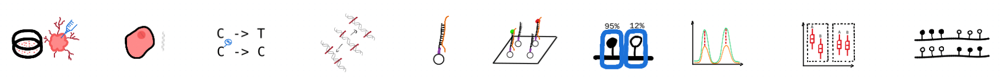

This Website contains content created for the [methylome masterclass project](https://www.uni-giessen.de/de/fbz/zentren/hd/projekte/hessenhub/digll-jlu-projekte-2/laufende-jlu-interne-foerderprojekte/methylome-fp2025). Included are links to our explanatory YouTube videos and visualizations of the jupyter notebooks, which include visualizations and explanations as well as R workflows for the analysis of Illumina Methylation Beadchip data.

Currently this website and the included content are in active developement and we plan to provide easy ways to execute the analysis workflow on your local machine. Currently, this is only possible if you run a docker container. To get access to the container, reach out to [us](mailto:niklas.philipp@mni.thm.de)

## Explanatory Videos (the images link to YouTube)

# Introduction

# Cell culture

# DNA extraction

## Jupyter Notebooks

# Wetlab Part 2 (following dna extraction)
[explanatory_notebook pdf](./notebooks/experimental_short.pdf)

[explanatory_notebook markdown](./notebooks/experimental_short.md)

# Methylation data analysis workflow in R
[analysis_notebook pdf](./notebooks/illumina_epicv2.pdf)

[analysis_notebook markdown](./notebooks/illumina_epicv2_md/illumina_epicv2.md)
